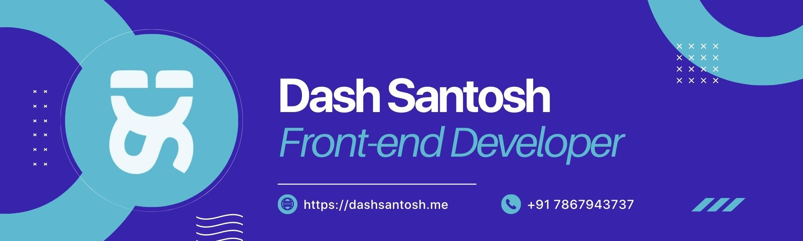

<h3>I'm a Frontend Developer and Freelance Designer from India.</h3>

- 🔭 I’m currently working on something awesome 🔥😎

- 🌱 I’m currently learning **ReactJs, React Native, NodeJs**

- 👨‍💻 All of my projects are available at [https://dashsantosh.vercel.app](https://dashsantosh.vercel.app)

- 📫 How to reach me **santdas36@gmail.com**

<h3 align="left">Connect with me:</h3>

<h3 align="left">Languages and Tools:</h3>

                 

<h3 align="left">Support:</h3>

  
